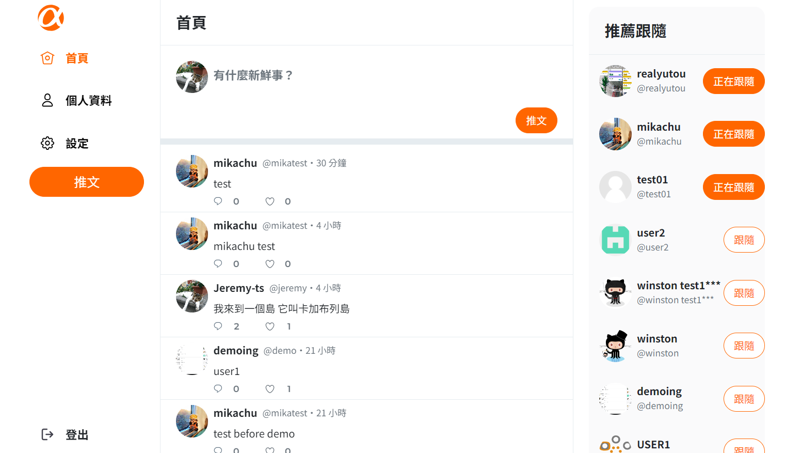

# Twitter
這是一個模擬 Twitter 社群平台的開發專案。專案展示在：**https://chungyingho.github.io/Twitter/**
* 前台測試 (帳號 / 密碼)：user1 / 12345678
* 後台測試 (帳號 / 密碼)：root / 12345678
### 專案示意圖 (Diagram)

### 功能 (Features)
這個 Twitter 專案可以分成兩個主要部分：**一般用戶**與**管理員後台**。
1. 一般用戶
    * 註冊 / 登入 / 登出。
    * 用戶可以追隨 / 取消追隨其他使用者。
    * 首頁
        * 瀏覽所有推文。
        * 發布推文。
        * 點擊單篇推文可以進入該推文頁面查看詳情以及回覆串。
        * 點擊主頁推文的留言圖標，或是推文頁面的留言圖標都可以發布回覆。
        * 點擊推文頁面的愛心圖標可以喜愛 / 取消喜愛該篇貼文。
        * 主頁及推文頁點擊用戶頭像可以查看該用戶詳細資訊頁。
    * 個人資料頁
        * 用戶可以編輯自己的名稱 / 頭貼 / 背景 / 自我介紹。
        * 用戶可以觀看自己發布過的貼文 / 回覆 / 喜愛的推文。
        * 用戶可以觀看自己現正追隨的用戶以及追隨者。
    * 設定頁
        * 用戶可以更改帳號 / 名稱 / Email / 密碼。
    * 推薦跟隨欄
2. 管理員後台
    * 登入 / 登出
    * 推文清單
        * 管理員可以看到目前 Twitter 上所有的推文。
        * 管理員可以刪除推文。
    * 使用者列表
        * 管理員可以看到所有使用 Twitter 的用戶。
### 專案開啟 (Installation)
1. 複製專案
```
git clone https://github.com/ChungYingHo/Twitter.git
```
2. 進入專案路徑
```
cd Twitter
```
3. 安裝套件
```
npm install
```
4. 啟動專案
```
npm start
```
5. 前往 **http://localhost:3000/Twitter** 查看網頁
### 環境建置與開發工具 (Prerequisites)
1. **react** / 18.2.0
2. **react-router-dom** / 6.15.0
3. **axios** / 1.4.0
4. **styled-components** / 6.0.7